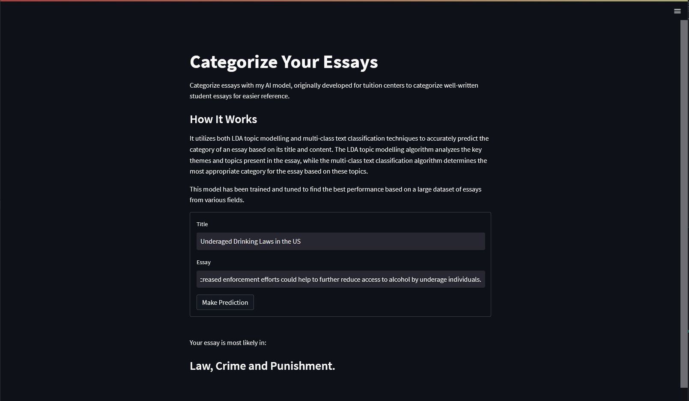
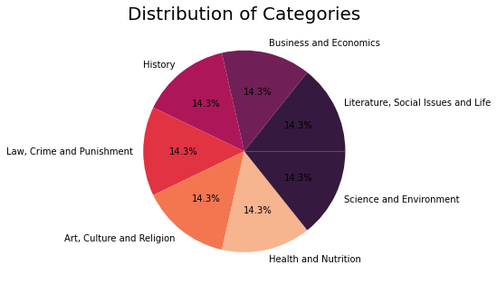
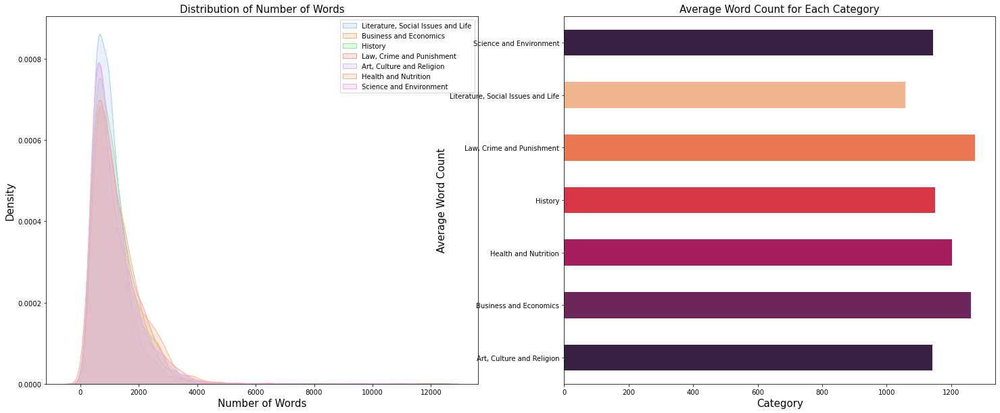
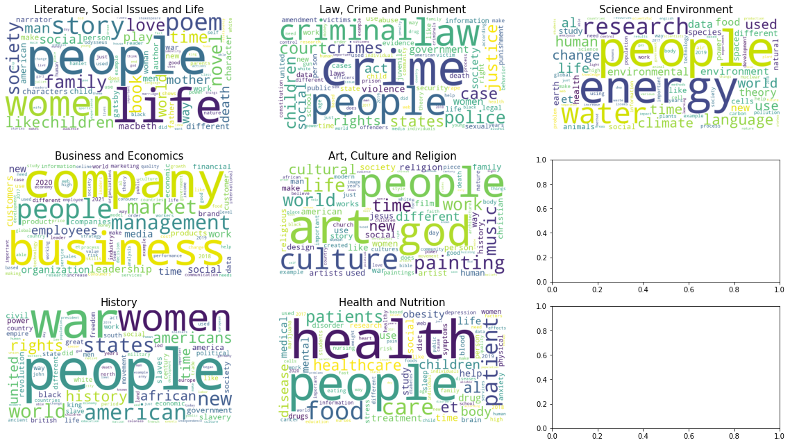
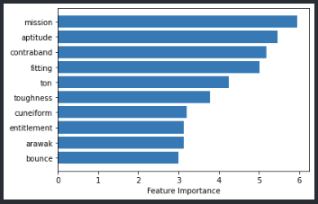

# Multi-Class Text Classification: Categorizing Essays

Problem: 📚 Education Industry, Tuition Centres have a database of past well-written student essays that could be used as reference for future students.

Our objective is to create an AI model to automate the categorization of essays at 75% accuracy for easier retrieval and reference, and ultimately for students to gain access to a wealth of valuable essays.

The AI model utilizes both LDA topic modelling and multi-class text classification techniques.

Date: February 2023 
Live site: https://categorizing-essays-ai.streamlit.app/   

## How it works

At it's core, the AI takes in preprocessed and tokenized text (title and essay) and returns the category. It uses LDA to assign the essay a topic number before using it in the text classification. The text classification model is a tuned Logistic Regression Model One Vs Rest used with TFIDF Vectorizers.

## The Process

#### Data Scraping
I first scraped 2.5k rows of data per category from GradesFixer's Essay Examples Website. As essays are long, much more time is needded to preprocess the text hence we've decided on a goal of 14k cleaned essays. GradesFixer's Essay Examples

These were the decided categories after looking at websites with essay samples, ensuring distinct categories. I also removed duplicates and essays with multiple overlapping categories before ensuring even distribution among categories.

  

#### Data Cleaning and Preprocessing
To clean the data, we would need to first understand what is needed. So I started with visualizing data to understand columns, null, duplicates and more.

Steps to Data Cleaning
- Handled Nulls (removed), Duplicates (none)
- Language Detection (remove noise of non-english data)
- Did the following on all text columns
- Whitespace Tokenization
- Negation Handling
- Expanded Contractions
- Removing diacritics (there were many in history essays, helps to decrease dimensionality)
- POS Tagging
- Normalized Text (case conversion, strip punctuation, special characters, numbers and stopwords
- Lemmatization with POS Tagging (to optimize)
- Generated Noun-Only and Summary-Only (LSA vs TextRank) datasets to identify main ideas and themes of the essay

Here are 2 of the most interesting insights gained.

Literature, Social Issues and Life Essays tend to have the lowest word count
  

"People" was one of the highly important repeated words across categories. Other than that, the categories and their top words correspond with each other.
  

Let's now move on to the modelling process.

#### Modelling Process
We will talk about this section briefly, mentioning keypoints and decisions made. I didn't include the actual jupyter notebook here with all the things I've done below but here's a quick overview.

- Initial Modelling with Vectorizers
    - After trying various models usally used to multi-class text classification, namely Linear SVM, LR (OneVsRest), NB, RF, MLP, Gradient Boosting and XGBoost, I've decided on LR OVR TFIDF, NB CV and MLP TFIDF
    - During that, I also experimented with using the following vectorizers for each model tested. CountVectorizer, TFIDf and Delta-TFIDF (which was found through research to be more useful that TFIDF by using the labels as well)
    - I also evaluated based on these metrics: ROC AUC, PR AUC, F1 Scores, Log Likelihood and Overfitting
- Hyperparameter Tuning with Vectorizers
    - I then did RandomizedCVSearch on the top 3 chosen models from initially where LR OVR TFIDF performed the best likely due to its simplicity, MLP had too much complexity for our model and use case and kept overfitting. 
    
- Nouns/Summary/Full Text (Nouns had the best balance of computing power needed and performance)
    - Found research that using nouns only help to reduce noise in Topic Modelling and I was wondering it that would help out with the model here as well.
- Initial Modelling with Word Embeddings
    - With LR OVR, I tried using Word2Vec Google News, GLoVe CommonCrawl and FastText English to see if it would improve as word embedding methods usually help the models to understand textual data better as it carries more hidden information.
    - FastText performs the best in terms of F1 Score (0.02 higher on average) and also has the least overfitting (0.03 higher than average) when compared to the other word embedding methods
    - Between FastText Model and previously tuned LR TFIDF Model, there was less overfitting but performed much worse in F1 scores across all categories. Also was't able to run RandomizedCVSearch for hyperparameter tuning due to lack of computational power.Hence we will go with TFIDF as we did initially.
- Topic Modelling Data Preprocessing
    - Remove small words of less than 3 characters
    - Extracted NERs to be used as a feature
    - Between Unigrams and Bigrams, I used Unigrams LDA Model (lower perplexity, higher coherence)
- Topic Modelling and Hyperparameter Tuning
    - I used evaluation metrics such as Quantitative: Perplexity and Coherence, Qualitative: Eye balling/visually inspecting the topics and their associated words through use of word clouds in terms of Relevance, Interpretability and Distinctiveness
    - I then tuned the LDA model with Optuna, tuning parameters such as num_topics, passes, iterations, alpha, beta (eta), per_word_topics
    - Optuna returned a model 14 topics, after further tuning and creating perplexity plots from different topic counts, I found that 12 topics was a much better suit as it had much lower perplexity values for the same coherence values.
    - Used LDA 12 Topics Model to get most probable topics for each essay where I found that overall F1 Scores across 5 KFolds does better a lot better though there's slightly more overfitting (5% and 10%)

That sums up what I did to get my final model which I then implemented with streamlit in order to get our final result.

## Contact
Jolene - [jolenechong7@gmail.com](mailto:jolenechong7@gmail.com)  